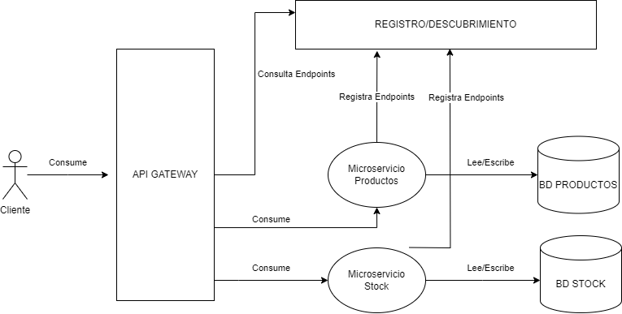

# api-microservicios
Sistema simple que muestra conceptos generales de una arquitectura basada en microservicios.

## Arquitectura
Incluye cuatro principales:
- **Servicio de Registro/Descubrimiento**: Servidor en python que expone un API REST simple para el registro/consulta de endpoints disponibles en nuestro universo de microservicios. El equivalente a utilizar [consul](https://www.consul.io/), [eureka](https://github.com/Netflix/eureka), entre otros.
- **Servicio de API Gateway**: Servidor en python que permite aglomerar las operaciones que involucran la utilización de diferentes microservicios para realizar una operación dada. Estas operaciones se exponen como un endpoint del API REST general, que internamente se redirecciona a cada microservicio puntual que se necesite. El equivalente a utilizar [Apache Apisix](https://apisix.apache.org/), [Apigee](https://docs.apigee.com/?hl=es-419) o inclusive [nginx](https://www.nginx.com/).
- **Servicio APM (Application Performance Monitoring)**: Servidor externo para agrupamiento y visualización de datos de instrumentación. Para esta implementación se utiliza [SigNoz](https://signoz.io/), por su carácter _open source_.
- **Implementación Dual de Microservicios**: Se utiliza _spring boot_ para implementar un servicio simple de manipulación de datos. Esta implementación agrupa dos servicios en una misma base de código, cada uno con la capacidad de gestionar su base de datos independientemente. Los microservicios puntuales contenidos son:
    - **Microservicio de Productos**: Servicio simple que permite el listado, alta, baja y modificación de entidades que representan un producto.
    - **Microservicio de Stock**: Servicio simple que permite el listado, alta, baja y modificación de entidades que representan el stock de un producto.

Para las bases de datos de cada microservicio, se utiliza [H2](https://www.h2database.com/html/main.html) como almacenamiento.

## Escalabilidad
Cada componente del sistema puede aumentarse para dar respuesta a mayores cargas de trabajo:
- **Servicio de Registro/Descubrimiento**: Para minimizar el impacto de llegar a ser un _single-point-of-failure_ para el sistema, se puede replicar este servicio y utilizar un mecanismo de consenso para mejorar la escalabilidad horizontal y contingencia ante fallos.
- **Servicio de API Gateway**: De la misma forma, se puede mejorar la escalabilidad y disponibilidad manteniendo una o más instancias de este servicio por detrás de algún balanceador de cargas.
- **Servicio APM**: Utilizar las facilidades brindadas por la herramienta utilizada. Para el caso de SigNoz, ver sus [recomendaciones](https://signoz.io/docs/production-readiness/).
- **Microservicios**: Para cada microservicio se utiliza un patrón de diseño de [database-per-service](https://microservices.io/patterns/data/database-per-service.html), por lo tanto, se puede mejorar la escalabilidad utilizando un almacenamiento nativamente distribuido (Ej.: [Apache Cassandra](https://cassandra.apache.org/_/index.html)) y replicando cada microservicio para conectarse a orígenes de dato dentro del clúster de la base de datos utilizada.

## Puesta a Punto

### Servicio de Registro/Descubrimiento
Sin pasos adicionales.

### Servicio de API Gateway
Sin pasos adicionales.

### Servicio APM
Cada componente del sistema esta instrumentado utilizando [OpenTelemetry](https://opentelemetry.io/) para la generación de trazas y datos de seguimiento. Toda la información recolectada se reenvía a SigNoz para su almacenamiento y análisis posterior. Es necesario generar un API KEY de *SigNoz Cloud* para poder enviar las trazas generadas.

### Microservicios
El mismo consiste en un proyecto java/maven que puede ser compilado ejecutando el siguiente comando:

`cd ./backend`

`mvn clean install`

## Ejecución
Se puede generar una imagen Docker para poner todos los servicios en marcha. Se puede crear y ejecutar la imagen con los siguientes comandos:

`cd ./docker`

`docker-compose build`

`docker-compose up --detach`

Antes de ejecutar la imagen Docker generada, es necesario establecer la variable de entorno *OTLP_INGEST_KEY* con el API KEY generado para SigNoz Cloud.

Si todo está correcto, el *API Gateway* debe ser accesible por: http://127.0.0.1:9001/.

## API
Actualmente, solo se expone un *endpoint* principal a través del *API Gateway* para la interacción con los microservicios. Esta interacción permite el registro de un producto y su stock, consumiendo sus respectivos microservicios. Se debe enviar un objeto JSON al endpoint /producto utilizando el método HTTP `POST`. Ej.:

`
curl -X POST http://127.0.0.1:9001/producto
   -H 'Content-Type: application/json'
   -d '{
    "producto": {
        "nombre": "nombre de producto",
        "descripcion": "la descripcion",
        "categoria": "la categoria"
    },
    "stock": {
        "precio": 5000,
        "stock": 10
    }
}'`

## Consideraciones
Existen diferentes aspectos que no son cubiertos en esta prueba de concepto, las cuales presentan puntos críticos en cualquier diseño de un sistema basado en microservicios:
- **Consistencia de Datos**: La operación de registro de producto primeramente utiliza el microservicio de productos para registrar los datos de cabecera de un producto y asignarle un identificador. Este identificador es utilizado posteriormente para indicar al microservicio de stock que debe generar un nuevo registro vinculado a este producto creado. Se deben aplicar mecanismos viables para mantener la consistencia de datos, como ser patrones [Saga](https://microservices.io/patterns/data/saga.html), [Outbox](https://microservices.io/patterns/data/transactional-outbox.html) o [transacciones distribuidas](https://es.wikipedia.org/wiki/Commit_de_dos_fases), según corresponda.